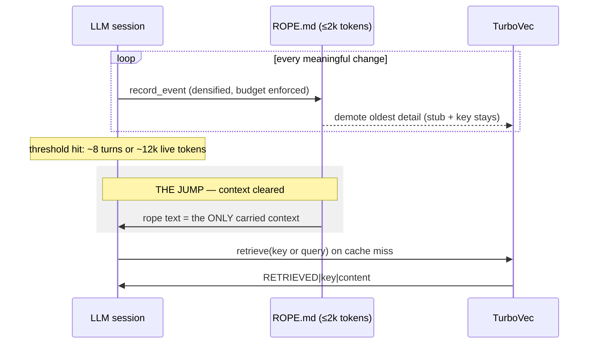
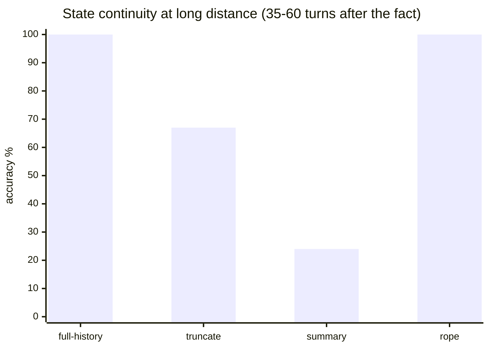
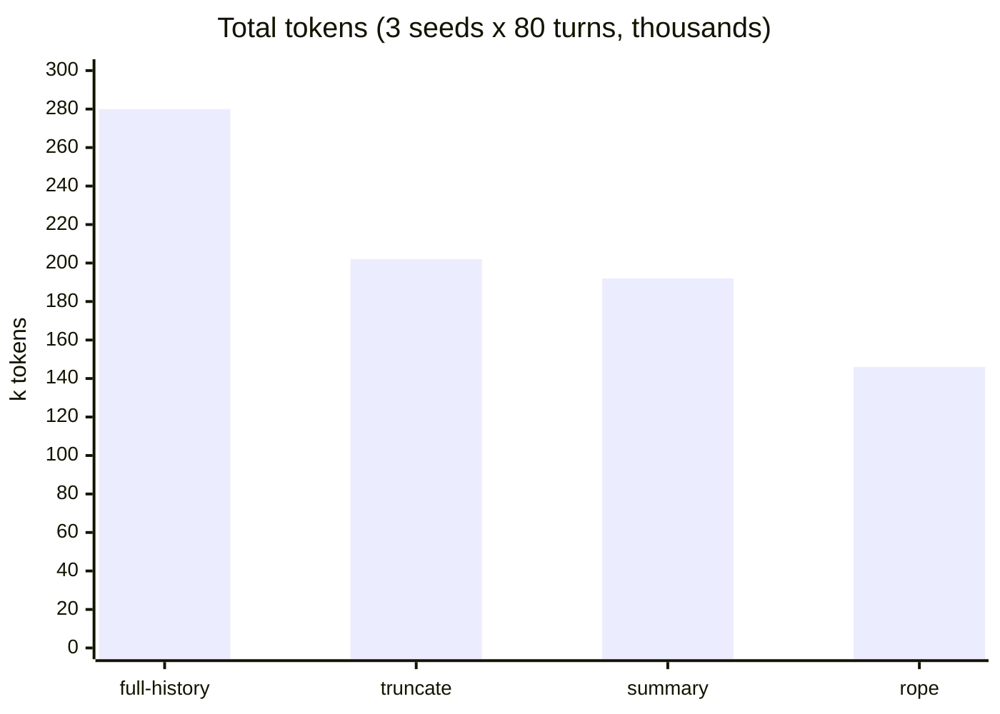
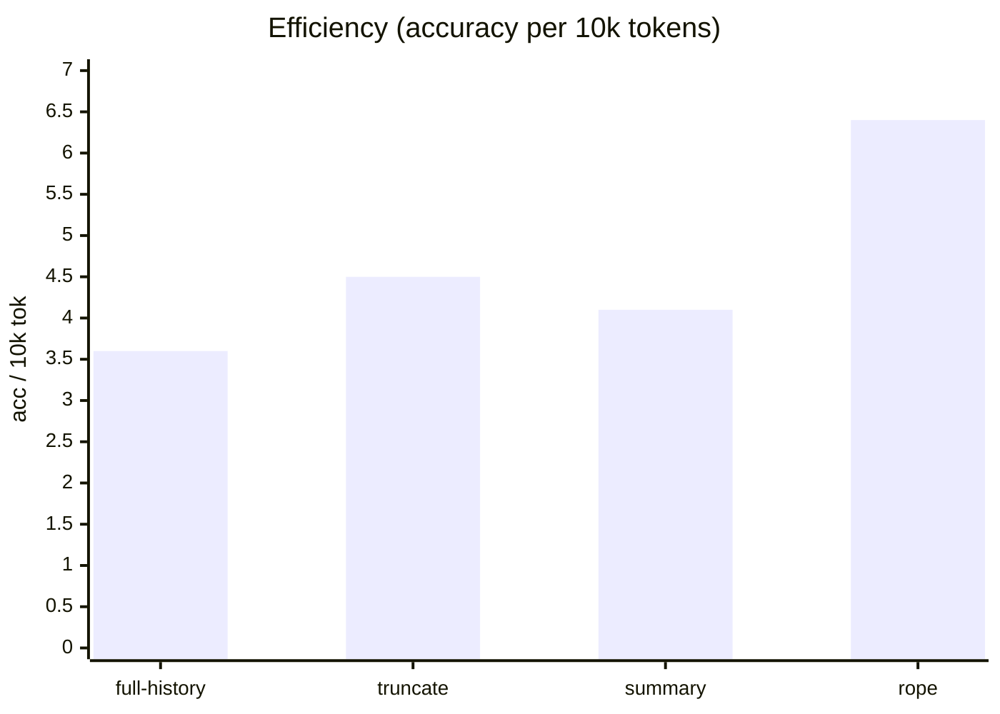

# jumprope.md

[](https://github.com/AlphaSaleAidan/jumprope.md/actions/workflows/ci.yml)

**Jumping Rope** is a two-tier context-handoff system for LLM sessions: session
state lives in a token-dense ledger under a hard budget instead of in the
transcript, so the context window can be cleared aggressively and often — the
session *jumps*, carrying only the rope. This repo is the umbrella project:
the system ([`jumping-rope/`](jumping-rope/)), the effectiveness benchmark
that drives its development ([`ropebench/`](ropebench/)), and the measured
evidence for every claim.

---

## 1. The theory

### The problem: transcripts are a terrible place to keep state

An agent session's context window fills with transcript — every prior turn
replayed so the model doesn't "forget". Three costs compound:

1. **Quadratic spend.** Carrying an ever-growing history means every turn
   pays for every previous turn. Cost grows with the square of session length.
2. **Attention degradation.** Long contexts dilute attention; the facts that
   matter sit in the middle of thousands of tokens of dead weight.
3. **Lossy rescue.** When the window finally overflows, auto-compaction
   summarizes — and summarization deterministically loses trailing detail:
   exact values, reasons for decisions, the things you actually needed.

The root error: **treating the transcript as the state**. Most of a
transcript is conversational scaffolding; the durable state — facts,
decisions with reasons, goal status, open threads — is a tiny fraction of it.

### The hypothesis: a memory hierarchy, not a scroll

Jumping Rope separates state from transcript and organizes it the way
computers have always organized memory:

| Memory hierarchy | Jumping Rope | Property |
|---|---|---|
| registers | `## STATE` / `## GOALS` / `## LEGEND` | never evicted, always resident |
| cache | the rope file (`ROPE.md`), **hard 2,000-token budget** | hot, dense, evicts by policy |
| disk | TurboVec (embedded sqlite vector store) | unbounded, key- and semantically-addressed |
| page fault | `RETRIEVED\|key\|content` | explicit, cheap, on demand |

Two design commitments follow:

- **The jump.** Because the hot state is small and self-contained, the
  context window becomes disposable. Clear it every ~8 turns or ~12k tokens
  — 3–5× more often than typical auto-compaction — and hand the fresh
  session the rope alone. Frequent cheap clears beat rare lossy ones.
- **Cache-miss semantics.** Detail evicted from the rope is not summarized
  away — it is *demoted* to TurboVec intact, leaving a one-line stub with a
  retrieval key and a topic digest. A fresh session that needs it looks it
  up, exactly like a page fault, instead of hoping a summary kept it.

### The notation: density is free capacity

The rope is written in `symbolic-en`: no articles, no filler verbs, `→` for
causality, status glyphs (`✓ ▶ ✗ ◌`), pipe-delimited records, abbreviations
declared once in a legend. Reasoning-class models don't need prose
redundancy — every token saved is budget for another fact. Measured: **42.1%
fewer tokens than equivalent prose** under o200k_base, so a 2,000-token rope
holds ~3,400 tokens' worth of state.

### The eviction policy

```mermaid
flowchart TD
    E[record_event] --> R
    subgraph R["ROPE.md — hard 2,000-token budget"]
        direction TB
        P["LEGEND · STATE · GOALS<br/><i>never demoted</i>"]
        D["DECISIONS → DELTA → OPEN P3/P2<br/><i>demote oldest-first</i>"]
        K["KEYS — one-line stubs<br/>K7&#124;topic digest&#124;tv-a1b2c3"]
    end
    D -- "budget breach" --> T[("TurboVec<br/>sqlite-vec / brute-force<br/>content-addressed keys")]
    T -- "stub left behind" --> K
    K -- "KEYS itself over budget" --> KR["keyring bundle<br/>KR:tok1,tok2,… digest"]
    KR --> T
```



P0/P1 open threads never demote — they survive every jump verbatim. When the
stub section itself grows too big, stubs coalesce into a **keyring** whose
digest carries one lexical handle per bundled member, so even a cold reader
can navigate two hops down without guessing opaque IDs.

### The jump, end to end



---

## 2. How it was tested

Three layers, each answering a different question, all zero-network and
deterministic in CI (the o200k_base vocabulary is bundled; a socket guard
fails any test that dials out).

### Layer 1 — mechanics: *does it do what the spec says?*

52 tests in [`jumping-rope/tests/`](jumping-rope/tests/): spec round-trip
(parse∘render = identity), the budget invariant checked **after every one of
200 writes**, the density benchmark, TurboVec determinism and fallback paths,
every CLI subcommand via subprocess, both chat adapters against fake
upstreams, and the "money test" — a 30-turn session with 12 planted facts,
≥3 jumps, then reconstruction from the rope alone with every demoted fact
recovered by key *and* by semantic search.

### Layer 2 — adversarial: *where does it break?*

A deliberate break-the-rope campaign
([`jumping-rope/ADVERSARIAL_REPORT.md`](jumping-rope/ADVERSARIAL_REPORT.md)):
29 attack tests written red-first, then fixed. Score: **8 broken → 8 fixed,
6 held**. The champion finding: the keyring was *dead code* for a cold
reader — a literal-minded agent recovered 0/20 facts through it because
stubs carried no member topics (semantic search was silently masking the
failure). After the digest fix: 20/20 recovered, 7 specifically via the
keyring hop, under hostile compaction with keyrings nested 4 generations
deep. Other kills: anchor/line-break injection that rendered the rope
unparseable, demote-before-persist loss on crash, thread races, silently
accepted unsatisfiable budgets.

The cold-agent harness matters methodologically: it is a **deterministic
policy, not an LLM** — it may only read stubs, follow lexical overlap,
recurse into listed keys (depth ≤3), and make one search call. It models the
worst realistic reader, so recovery numbers are floors, not averages.

### Layer 3 — effectiveness: *is the strategy actually better?*

This is what normal benchmarks cannot answer, because they vary the model
and fix the context. [`ropebench/`](ropebench/) inverts that: **the model is
held constant and the context policy varies.** The same seeded session
stream — facts, decisions with reasons, goal transitions, filler churn —
is replayed through four regimes:

| Regime | Policy | Role |
|---|---|---|
| `full-history` | carry everything | oracle ceiling, cost worst-case |
| `truncate` | drop-oldest under a budget | the cheap baseline |
| `summary` | old lines collapse to first words, then drop | stand-in for auto-compaction |
| `rope` | real `JumpingRopeSession` + retrieval tool | the strategy under test |

Probes with owned ground truth are planted at stratified distances (2–5,
12–25, 35–60 turns after the fact entered the session) and scored by
substring match — no LLM judges, no judge noise. Scoring covers fact
retention, decision recall, goal status, and retrieval discipline; cost is
accrued honestly (every turn pays that regime's current context size).

The scripted reader measures **information availability** (is the answer
findable at all?); live mode swaps in a real model over any OpenAI-compatible
endpoint to measure **information use** (does the model exploit it?).

---

## 3. Results and expected outcomes

### Hypotheses → measurements

| # | Hypothesis (stated before measuring) | Measured | Verdict |
|---|---|---|---|
| H1 | Dense notation cuts ≥40% of prose tokens | 42.1% (140→81 tok, o200k_base) | ✅ |
| H2 | Post-jump payload < 20% of naive history | 17.3% (pipe) / 17.8% (proxy) | ✅ |
| H3 | Rope beats lossy baselines on long-distance retention at a fraction of oracle cost | 100% vs 67% (truncate) / 24% (summary), at 52% of oracle tokens | ✅ |
| H4 | Demoted facts recoverable by a literal cold reader through the keyring | 20/20 (7 via keyring hop) — after fixing A1 | ✅ (post-fix) |
| H5 | A live model keeps ≥90% of its full-history accuracy on the rope at ≤35% of the tokens, hallucinating <5% | **pending** — Phase 2 live sweep | ⏳ |

### The headline sweep (scripted, 3 seeds × 80 turns, 78 probes)

| Regime | Acc | short | medium | long | fact | decision | status | retrieval used | tokens | acc/10k tok |
|---|---|---|---|---|---|---|---|---|---|---|
| full-history | 100% | 100% | 100% | 100% | 100% | 100% | 100% | 0% | 280,455 | 3.6 |
| truncate | 91% | 100% | 100% | 67% | 92% | 88% | 94% | 0% | 201,517 | 4.5 |
| summary | 79% | 100% | 100% | 24% | 75% | 75% | 94% | 0% | 192,357 | 4.1 |
| **rope** | **94%** | 100% | 83% | **100%** | 100% | 79% | 100% | 56% | **145,933** | **6.4** |

**Long-distance retention** — the regime a context strategy exists for:



**Token cost** for the identical 240-turn workload:



**The Pareto number** — accuracy points per 10k tokens spent:



Read together: summary-style compaction — the industry default — collapses
to 24% on old facts. Truncation is cheaper but forgets a third of them. The
rope holds **everything** at long distance for **half the oracle's spend**,
and it does so *because* the retrieval tier is load-bearing (56% of probe
answers used it) — not despite it.

### Expected outcome of the program (and honest limits)

The end state this project is driving toward: **an agent that runs
indefinitely at flat per-turn cost, whose task performance is statistically
indistinguishable from carrying the full transcript** — verified by the
live-mode sweep (H5), then by replaying real agent workloads (roadmap
Phase 5).

Known, measured limits on the way there
([`ropebench/ROADMAP.md`](ropebench/ROADMAP.md)):

- **B1 — decision recall 79%.** Decisions demote first, then depend on
  hash-embedder recall. Fix queued: hybrid lexical+vector search in TurboVec.
- **B3 — paraphrase blindness.** Under 200 one-token-off distractors the
  hash embedder finds verbatim and near-verbatim queries but misses
  paraphrases (67% top-3). Exact keys are immune; deployments needing
  paraphrase-robust recall use the `[st]` sentence-transformer extra.
- **Keyring depth.** Facts buried deeper than 3 keyring generations exceed a
  literal reader's recursion; semantic search and exact keys still reach them.

---

## 4. Components

| Dir | What | Status |
|---|---|---|
| [`jumping-rope/`](jumping-rope/) | The system: rope spec, compactor, TurboVec, `jrope` CLI, adapters (Claude Code skill, Open WebUI pipe, OpenAI-compatible proxy) | 81 tests green, adversarially verified |
| [`ropebench/`](ropebench/) | The benchmark: 4 regimes, stratified probes, scripted + live modes, regression gate for all future changes | 25 tests green, first sweep complete |

```bash
# try the system (quickstarts for all 4 deployment targets in jumping-rope/README.md)
pip install -e "./jumping-rope[dev]" && cd jumping-rope && pytest -q && python examples/demo_session.py

# reproduce the benchmark table above
pip install -e ./ropebench --no-deps && ropebench run --mode scripted --seeds 3 --turns 80
```

## Provenance

Imported with full git history (`git subtree`) from
[jumping-rope](https://github.com/AlphaSaleAidan/jumping-rope) (branch
`test/adversarial-v1`, all adversarial fixes) and
[ropebench](https://github.com/AlphaSaleAidan/ropebench) (branch
`feat/ropebench-v1`). Each component keeps its own README, tests, MIT
license and CI; the root workflow tests both against each other. Development
plan: [`ropebench/ROADMAP.md`](ropebench/ROADMAP.md).
