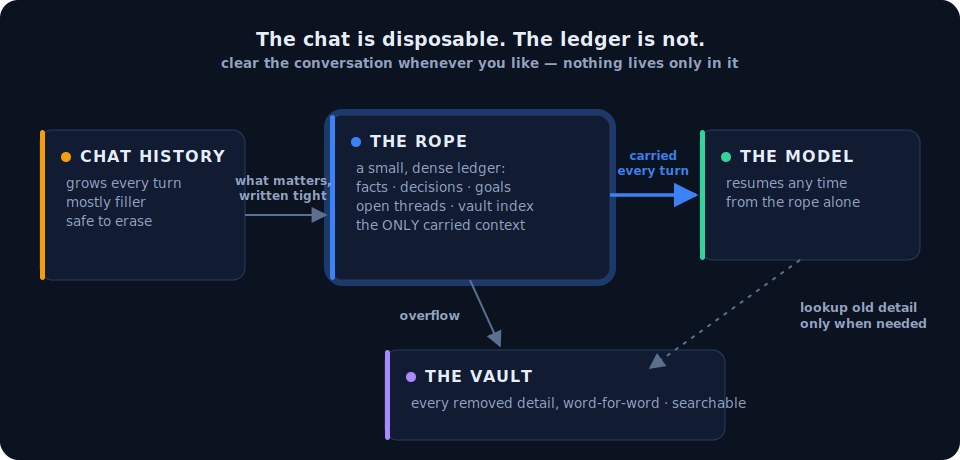
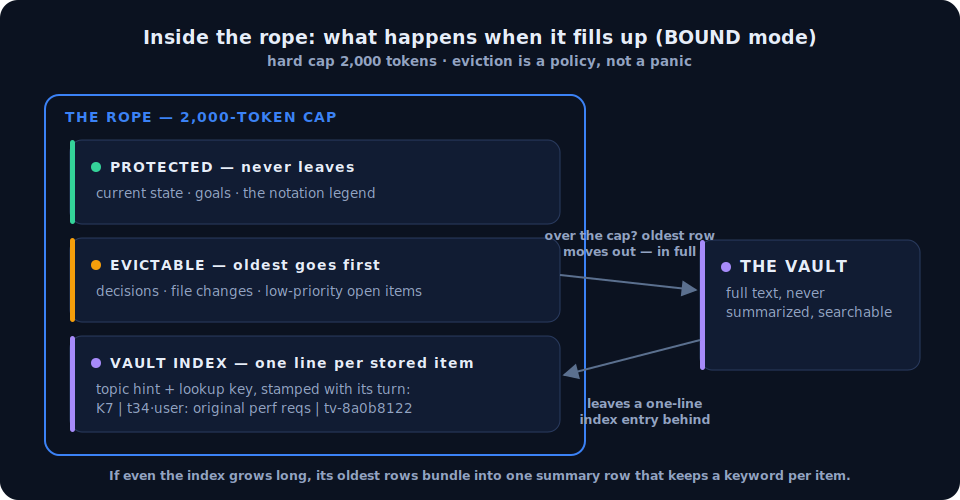
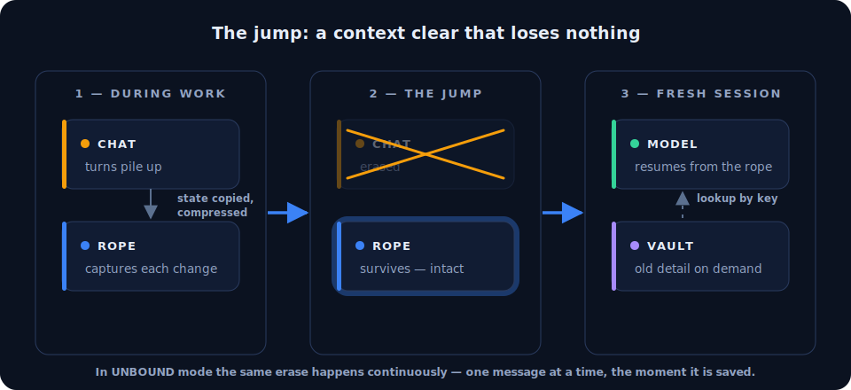
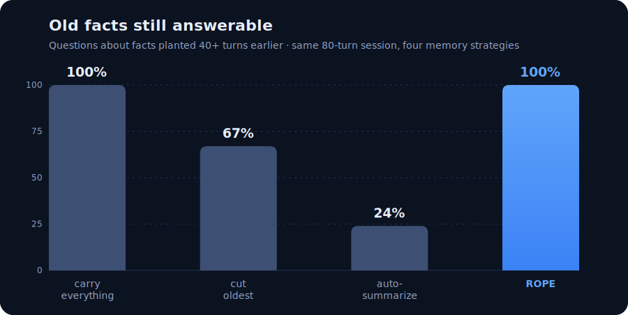
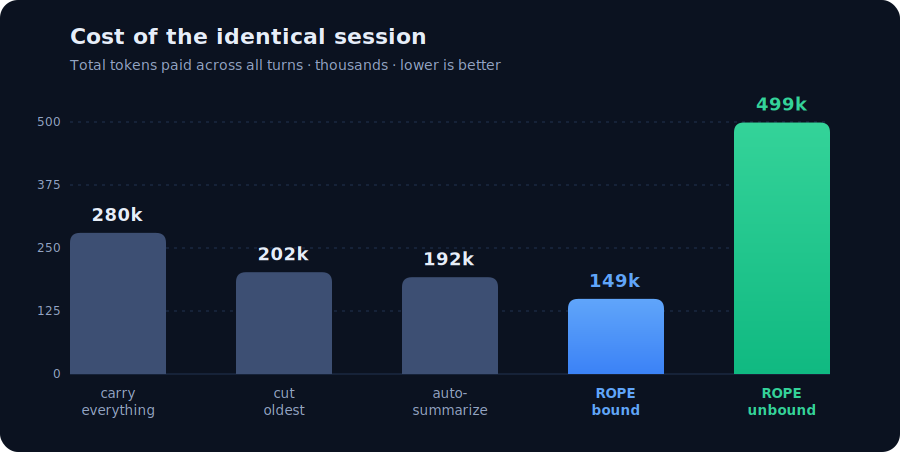
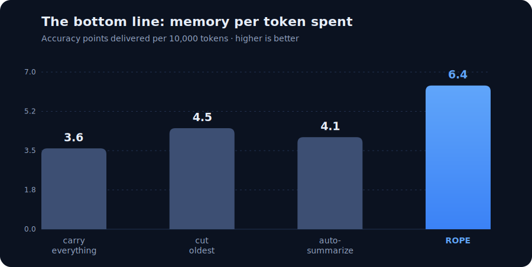

# jumprope.md

[](https://github.com/AlphaSaleAidan/jumprope.md/actions/workflows/ci.yml)

**Long AI sessions forget things and get expensive. Jumping Rope fixes both
by keeping the session's memory in a small ledger instead of the chat
history.**

The color code used in every diagram below: **yellow** = the chat history,
**blue** = the rope (the ledger), **purple** = the vault (deep storage),
**green** = the model.

---

## 1. The idea in one picture

<p align="center"></p>

**How to read it.** Follow the arrows left to right. As the conversation
runs, everything that actually matters — a fact, a decision, a goal, an
unresolved problem — is copied onto the rope in a compressed notation
(solid thin arrow). The rope is the only thing the model has to carry
between turns (thick arrow). If the rope ever sheds older detail, that
detail moves *down* into the vault in full, never deleted (solid thin
arrow), and the model can pull it back with a lookup (dotted arrow). The
chat history itself is now disposable: clearing it loses nothing, because
nothing lives only there.

---

## 2. Two modes — pick per session

| | **BOUND** | **UNBOUND** |
|---|---|---|
| The rope | hard cap: 2,000 tokens | grows as needed (still tiny vs. chat) |
| What gets deleted | oldest rope detail — moved to the vault | the chat history itself, as soon as it's saved |
| When context clears | every ~8 turns, all at once ("the jump") | continuously, every single turn |
| Where old details live | the vault (one lookup away) | still on the rope, word-for-word |
| Main risk | a lookup can miss (measured below) | rope size on week-long sessions |

**Use BOUND when** the agent runs unattended for days and token cost
dominates; the model's context window is small or expensive; you're
metering an API middleware where every token is billed; or the session is
full of churn nobody will ever ask about again.

**Use UNBOUND when** the work is interactive and a failed lookup would
stall you — decisions and facts stay on the rope verbatim, so there is no
recall risk at all; the model has a large, cheap context window; sessions
run hours to days; or you want the rope's key section to double as a
turn-by-turn index of the conversation (each saved message gets a
`t42·`-stamped entry — "saved at turn 42").

Switching is one flag: `jrope init --mode unbound`, `JumpConfig.unbound()`
in Python, the `MODE` valve in Open WebUI, `JROPE_MODE` for the proxy.

---

## 3. What the rope actually looks like

```markdown
# ROPE v1 | sess:a1b2c3 | j:2 | t:2026-07-04T09:00:00Z
## STATE
branch:feat/rate-limiter
## GOALS
✓ G1|impl token-bucket limiter
▶ G2|wire limiter into middleware
## DECISIONS
D4|2026-07-03|redis INCR over lua script|simpler, atomic enough
## OPEN
O2|P1|EXPIRE race under concurrent INCR
## KEYS
K7|t34·user: original perf reqs|tv-8a0b8122
```

**How to read it.** Line by line: the header says this is session `a1b2c3`,
the context has been cleared twice (`j:2`). `STATE` holds always-true facts
(current branch). `GOALS` uses one status mark per goal — `✓` done, `▶`
active, `◌` waiting, `✗` failed. `DECISIONS` records *what* was decided and
*why*, because the "why" is the first thing a summary loses. `OPEN` is the
unresolved-problems list with priorities (`P1` = important, survives
everything). `KEYS` is the index into the vault: entry `K7` says "the full
text of the user's message from turn 34 is in the vault under key
`tv-8a0b8122`". The whole file reads telegram-style on purpose — measured
**42% fewer tokens than plain prose**, and the `ai-native` profile saves a
further **17%** on repetitive sessions by abbreviating the session's own
recurring phrases (each abbreviation declared once in a legend).

---

## 4. How the machinery works

### What happens when the rope is full (BOUND mode)

<p align="center"></p>

**How to read it.** Every write lands on the rope first. If that pushes the
rope over its 2,000-token cap, the compactor evicts — but never blindly:
the top box (state, goals, legend) is untouchable; eviction takes the
*oldest* decision or file-change first, and only low-priority open items,
never urgent ones. Each evicted row goes to the vault **in full** and
leaves a one-line index entry behind (bottom box) so it can always be found
again. If even the index grows too long, old index rows are bundled into a
single summary row whose label lists a keyword from every bundled item —
that keyword list is what lets a brand-new session navigate down to any
buried fact. This exact path was attack-tested: a simulated "cold reader"
recovered 20 of 20 planted facts through it.

### What a context clear looks like (the jump)

<p align="center"></p>

**How to read it.** Time flows top to bottom. During normal work (the loop)
the model keeps writing state onto the rope, and the rope quietly spills
overflow into the vault. When the chat history gets heavy, everything is
erased except the rope — that is the jump, the blue band. The fresh session
starts from the rope alone. When it hits a question the rope can't answer
(bottom two arrows), it asks the vault and gets the original text back —
a lookup, not a guess. In UNBOUND mode there is no discrete jump: the erase
happens continuously, one message at a time, the moment each message has
been saved.

---

## 5. Does it actually work? (measured, not vibes)

Method: the same scripted 80-turn session is replayed through four memory
strategies. Questions about planted facts are asked throughout, and each
strategy is scored on what it can still answer and what it spent. Full
methodology and code: [`ropebench/`](ropebench/).

The four strategies, in the order they appear in every chart:

1. **carry everything** — never delete anything (perfect memory, maximum cost)
2. **cut oldest** — when full, delete the oldest messages
3. **auto-summarize** — when full, compress old messages into summaries
   (what most AI tools do today)
4. **ROPE** — this project

### Chart 1 — memory of old facts

<p align="center"></p>

**How to read it.** Each bar is one strategy; the height is the share of
40-plus-turn-old facts it could still answer. Carrying everything scores
100% by definition — that's the ceiling, not a competitor. Cutting the
oldest messages forgets a third. Auto-summarize is the striking one: it
forgets **three out of four** old facts, because summaries eat exactly the
things you ask about later — exact values, reasons, details. The rope
matches the ceiling: 100%.

### Chart 2 — cost of the identical session

<p align="center"></p>

**How to read it.** Same four strategies, but now the height is the total
token bill for the identical 80-turn session (every turn pays for whatever
context that strategy carries). Carrying everything costs 280k — the
worst case, and it grows quadratically with session length. The two lossy
strategies save some cost but, per Chart 1, pay for it in memory. The rope
is the cheapest of all four at 146k — **about half the ceiling's cost** —
because its carried context is a dense ledger instead of a transcript.

### Chart 3 — the bottom line (memory per token spent)

<p align="center"></p>

**How to read it.** This chart divides Chart 1 by Chart 2: how much correct
memory does each dollar of tokens buy? It's the single number that captures
the trade-off — a strategy could cheat Chart 1 by hoarding everything, or
cheat Chart 2 by deleting everything, but not this one. The rope delivers
**6.4 accuracy points per 10k tokens, 1.8× better than carrying everything**
(3.6) and well ahead of both lossy baselines. This is the claim of the whole
project in one bar.

### Predictions vs. measurements

| Hypothesis (stated before measuring) | Predicted | Measured | |
|---|---|---|---|
| Dense notation saves tokens | ≥40% vs prose | 42.1% | pass |
| Post-clear payload is small | <20% of full history | 17–18% | pass |
| Beats lossy baselines on old facts, cheaper than the ceiling | — | 100% vs 67/24, at 52% cost | pass |
| A cold session can recover vaulted facts through the index | ≥19/20 | 20/20 | pass |
| A live LLM keeps ≥90% of its ceiling accuracy on the rope | at ≤35% of tokens | **pending — next phase** | — |

The last row is the honest one: everything above was measured with a
deterministic reader (it proves the information is *findable*). The live
phase swaps in a real model to prove the model actually *uses* it.

---

## 6. How it was hardened

1. **52 mechanics tests** — the token cap is re-checked after every single
   one of 200 writes; a 30-turn "money test" reconstructs a session from
   the rope alone and recovers every vaulted fact.
2. **29 adversarial tests, written to break it — and they did.** 8 real
   breaks found, fixed, and regression-locked: crash-timing that lost data,
   text injection that corrupted the ledger, a vault index that was
   silently useless to fresh sessions. Full report with all verdicts:
   [`jumping-rope/ADVERSARIAL_REPORT.md`](jumping-rope/ADVERSARIAL_REPORT.md).
3. **The benchmark of section 5**, re-run as a regression gate on every
   change since.

All 116 tests are deterministic and run with zero network access.

---

## 7. Components

| Dir | What | Status |
|---|---|---|
| [`jumping-rope/`](jumping-rope/) | The system: rope format, vault, `jrope` CLI, adapters for Claude Code / Open WebUI / any OpenAI-compatible stack | 91 tests green |
| [`ropebench/`](ropebench/) | The benchmark: 4 strategies, planted-question scoring, scripted + live modes | 25 tests green |

```bash
# try it
pip install -e "./jumping-rope[dev]"
cd jumping-rope && python examples/demo_session.py

# reproduce the charts
pip install -e ./ropebench --no-deps
ropebench run --mode scripted --seeds 3 --turns 80
```

Development plan (what's next, known limits, the live-model phase):
[`ropebench/ROADMAP.md`](ropebench/ROADMAP.md). Imported with full git
history from [jumping-rope](https://github.com/AlphaSaleAidan/jumping-rope)
and [ropebench](https://github.com/AlphaSaleAidan/ropebench). MIT.
