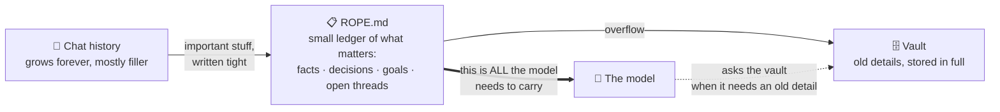
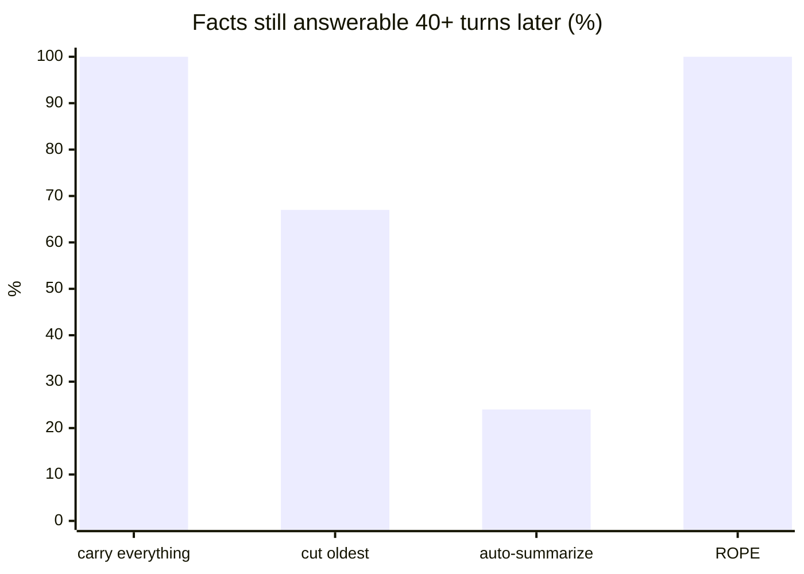
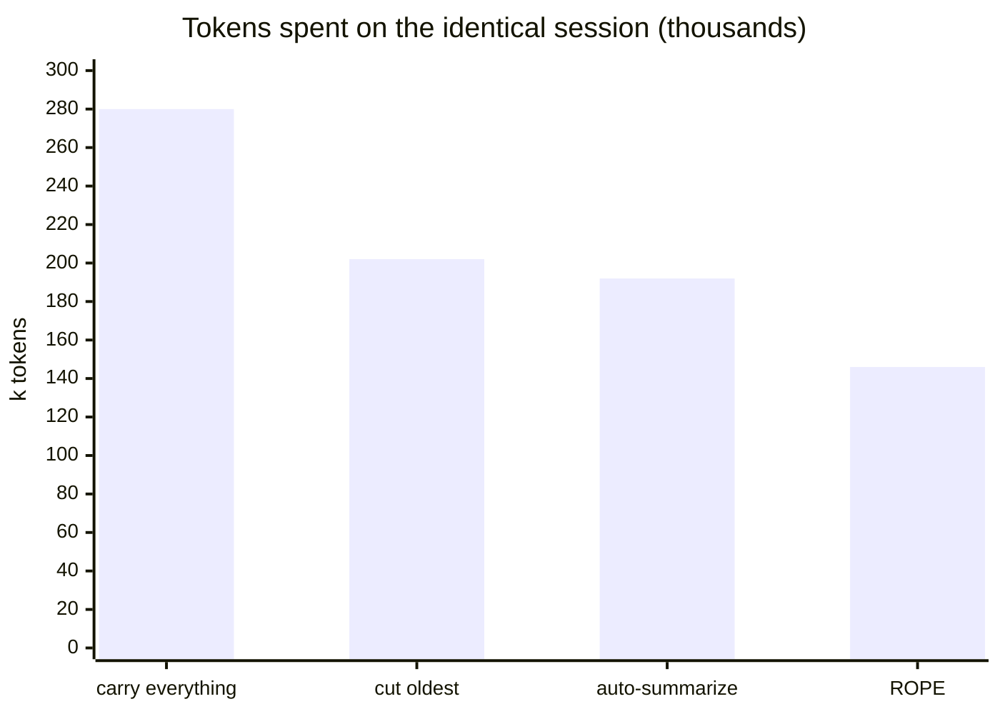

# jumprope.md

[](https://github.com/AlphaSaleAidan/jumprope.md/actions/workflows/ci.yml)

**Long AI sessions forget things and get expensive. Jumping Rope fixes both
by keeping the session's memory in a small ledger instead of the chat
history.**

## The idea in one picture



The chat history becomes disposable. Clear it whenever you like — the ledger
(the *rope*) carries the session. Anything that fell off the rope is in the
vault, one lookup away.

## Two modes — pick per session

| | 🪢 **BOUND** | 🎈 **UNBOUND** |
|---|---|---|
| The rope | capped at 2,000 tokens | grows as needed (still tiny vs. chat) |
| What gets deleted | old rope detail → moved to the vault | the **chat history itself**, as soon as it's saved |
| When context clears | every ~8 turns ("the jump") | continuously — every single turn |
| Old details | one lookup away | still on the rope, word-for-word |

**Use BOUND for:** unattended agents running for days, cheap models with
small context windows, API middleware where every token is billed, noisy
sessions full of churn nobody will ask about again.

**Use UNBOUND for:** interactive work where a failed lookup would stall you
(nothing is ever moved out — decisions stay verbatim), models with big cheap
context windows, hours-to-days sessions, and when you want the rope's key
log to double as a browsable index of the whole conversation — every saved
message gets a `t42·`-stamped entry, so the ledger lines up with the chat
log turn by turn.

## What the rope actually looks like

```markdown
# ROPE v1 | sess:a1b2c3 | j:2 | t:2026-07-04T09:00:00Z
## STATE
branch:feat/rate-limiter
## GOALS
✓ G1|impl token-bucket limiter
▶ G2|wire limiter into middleware
## DECISIONS
D4|2026-07-03|redis INCR over lua script|simpler, atomic enough
## OPEN
O2|P1|EXPIRE race under concurrent INCR
## KEYS
K7|t34·user: original perf reqs|tv-8a0b8122
```

Dense on purpose: no articles, no filler, `✓ ▶ ✗ ◌` for status, one line per
fact — **42% fewer tokens than plain prose** (measured). The `ai-native`
profile goes further: it learns the session's own recurring phrases and
shortens them with codes declared once in a legend — another **17% off** on
repetitive sessions. `K7|t34·…` means "full text saved from turn 34 —
key `tv-8a0b8122` fetches it".

## Does it actually work? (measured, not vibes)

The same 80-turn session was replayed through four memory strategies with
questions planted throughout, then scored on what could still be answered.
Full details: [`ropebench/`](ropebench/).

**Question: 40+ turns later, how much do they still remember?**



**Question: what did the same session cost?**



Read the two charts together:

- **Carry everything** remembers 100% — at maximum cost. That's the ceiling.
- **Auto-summarize** (what most tools do today) forgets **3 out of 4** old
  facts. Summaries eat exact values, reasons, details.
- **The rope remembers 100% of old facts at about half the cost** — the only
  strategy that matches the ceiling without paying for it.

| Hypothesis | Predicted | Measured | |
|---|---|---|---|
| Dense notation saves tokens | ≥40% | 42.1% | ✅ |
| Post-clear payload is small | <20% of full history | 17–18% | ✅ |
| Beats baselines on old facts, cheaper | — | 100% vs 67/24, at 52% cost | ✅ |
| A cold reader can recover archived facts | ≥19/20 | 20/20 | ✅ |
| A live LLM keeps ≥90% of its ceiling on the rope | ≤35% of tokens | **pending** (next phase) | ⏳ |

## How it was hardened

1. **52 mechanics tests** — the budget invariant is checked after *every one*
   of 200 writes; a 30-turn "money test" reconstructs a session from the rope
   alone and recovers every archived fact.
2. **29 adversarial tests, written to break it** — and they did: 8 real
   breaks found and fixed (crash-loss ordering, parser injection, a
   navigation index that was silently dead code). Full report:
   [`jumping-rope/ADVERSARIAL_REPORT.md`](jumping-rope/ADVERSARIAL_REPORT.md).
3. **The benchmark above**, re-run as a regression gate on every change.

All 116 tests run with zero network access and are deterministic.

## Components

| Dir | What | Status |
|---|---|---|
| [`jumping-rope/`](jumping-rope/) | The system: rope spec, vault, `jrope` CLI, adapters for Claude Code / Open WebUI / any OpenAI-compatible stack | 91 tests green |
| [`ropebench/`](ropebench/) | The benchmark: 4 strategies, planted-question scoring, scripted + live modes | 25 tests green |

```bash
# try it
pip install -e "./jumping-rope[dev]"
cd jumping-rope && python examples/demo_session.py

# reproduce the charts
pip install -e ./ropebench --no-deps
ropebench run --mode scripted --seeds 3 --turns 80
```

Development plan (what's next, known limits, the live-model phase):
[`ropebench/ROADMAP.md`](ropebench/ROADMAP.md). Imported with full git
history from [jumping-rope](https://github.com/AlphaSaleAidan/jumping-rope)
and [ropebench](https://github.com/AlphaSaleAidan/ropebench). MIT.
