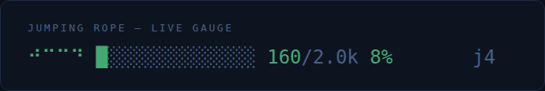

# Rope gauge — Claude Code statusline

A live gauge of how full the Jumping Rope ledger is, right in your Claude Code
status line. As the rope fills toward its token budget the bar shifts **warmer**
(green → amber → red) *and* its pulse gets **faster** — a calm breathing green
when there's headroom, a fast red flicker when it's about to jump.

```
🪢/ ████░░░░░░░░░░ 511/2.0k 26% j1        ← plenty of headroom (calm green)
🪢─ ███████████░░░ 1.5k/2.0k 75% j3        ← working harder (amber, quicker pulse)
🪢\ ██████████████ 2.2k/2.0k 100% JUMP! j5 ← about to compact (red, fast flicker)
🪢| 12.4k tok ∞ unbound · j7               ← unbound mode
```

Every WRITE to the rope is visible too: when the ledger grows, the gauge
flashes the token delta (`+12`) in white-hot and the bar's newest cell burns
white for ~6 seconds — the rope visibly ticks as facts are recorded, even
when the fill moves less than one cell. (State lives in a tiny
`.gauge-state` file beside the rope.)

The stroke after the emoji rotates `| / ─ \` — the rope whipping around.
Because Claude Code only refreshes the status line while the session is
active, the rope visibly spins **while the session is working** and freezes
when it's idle. Set `JROPE_ANIMATE=0` for a still gauge, `JROPE_EMOJI` to
taste (`➰` reads nicely as a rope mid-swing).

### Drawn rope (`JROPE_STYLE=drawn`)

<p align="center"></p>

No emoji at all: a custom-drawn rope in braille pixel art (each braille char
is a 2×4 pixel grid — four chars make an 8×4 canvas). Twelve frames plot the
rope's actual curve `sin(πx/w)·cos(θ)` through a full revolution — arc over
the top, whip past level, arc under the feet, back past level — exactly what
a jump rope looks like from the front, no holder. It's tinted with the gauge
color, so the rope itself warms green→amber→red and pulses as it fills:

```
⠚⠉⠉⠙  ⠒⠚⠙⠒  ⠤⠖⠒⠦  ⠤⢤⣠⠤  ⢤⣀⣀⣠  ⠤⢤⣠⠤  ⠤⠤⠤⠤  ⠒⠚⠙⠒   ↻
⣀⣀⣀⣀  no rope — the rope lies slack on the ground until /jumprope-start
```

`rope-demo.html` is the animation source — open it in a browser to watch it
free-run, or drive `setFrame(i)` deterministically (that's how
`rope-gauge.gif` above was rendered: 48 frames → GIF at 12 fps).

## Install

Point Claude Code's status line at the script (in `~/.claude/settings.json` or a
project `.claude/settings.json`):

```json
{
  "statusLine": {
    "type": "command",
    "command": "python3 /ABS/PATH/jumping-rope/adapters/claude-statusline/statusline.py"
  }
}
```

That's it — no dependencies (pure stdlib, fast enough to run on every refresh).

## How it finds the rope

Per refresh Claude Code pipes session JSON on stdin. Discovery order:

1. `JROPE_ROPE_PATH`, if set.
2. **Per-session**: `.claude/jumprope/sessions/<session_id>/ROPE.md` for the
   session id on stdin — the convention the
   [`/jumprope-*` commands](../claude-commands/) create. Once a
   `sessions/` dir exists, a session with no rope of its own shows
   `no rope — /jumprope-start` rather than borrowing another session's rope,
   so concurrent sessions in one repo each get an honest gauge.
3. Otherwise (single-rope setups, unchanged): the freshest `ROPE.md` under
   the workspace (`ROPE.md`, `.jumprope/**/ROPE.md`,
   `.claude/jumprope/**/ROPE.md`). No rope yet → `🪢 no rope yet`.

## Tuning

Precedence: env vars → an `env` file of KEY=VALUE lines next to the rope
(session dir `env`, then repo-wide `.claude/jumprope/env`) → defaults. The
`env` file is what `/jumprope-mode` writes, so mode/budget/emoji stick
per session.

| var | default | meaning |
|-----|---------|---------|
| `JROPE_ROPE_PATH` | auto-discover | force a specific rope file |
| `JROPE_BUDGET` | `2000` | bound-mode token budget the bar fills toward |
| `JROPE_MODE` | `bound` | set `unbound` for the ∞ readout |
| `JROPE_EMOJI` | `🪢` | the gauge glyph (try `➰`) |
| `JROPE_ANIMATE` | `1` | `0` disables the rope-swing animation |
| `JROPE_STYLE` | `emoji` | `drawn` swaps the emoji for the braille-art rope above |

Token count is a fast `~chars/4` estimate — plenty accurate for a gauge, and it
keeps the status line snappy. The colour/pulse curve (green→amber→red, pulse
frequency `1.1 + fill·7.5`) is the same one in `preview.html`, a browser mock you
can open to see it animate.
```
